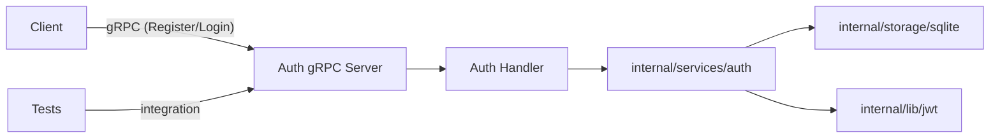

### Proto repo -> [https://github.com/KarenTsaturyan/proto_go]

 # The code isn't supposed to work as production AUTH service, it's just base implementation, to see how gRPC works

# REST vs gRPC

## Overview
A concise comparison between **REST** and **gRPC** for designing APIs and microservices. This repository uses gRPC for the Auth service to take advantage of strongly-typed contracts, binary performance and first-class streaming.

---

## REST
- Protocol: HTTP/1.1 (commonly) with JSON payloads.
- Style: Resource-oriented and human-readable.
- Strengths:
  - Broad ecosystem and easy to test with curl / browsers.
  - Good for public HTTP APIs and services targeting browsers.
  - Simple and debuggable (JSON, plain text).
- Trade-offs:
  - Larger textual payloads (more bandwidth).
  - No built-in streaming; less efficient binary handling.

---

## gRPC
- Protocol: HTTP/2 + Protocol Buffers (binary).
- Style: RPC (contract-first via `.proto` files).
- Strengths:
  - High performance (binary, multiplexed over HTTP/2).
  - Auto-generated typed clients/servers from `.proto`.
  - Built-in support for unary and streaming RPCs.
- Trade-offs:
  - Binary payloads require tooling for inspection.
  - Requires protoc + plugins to generate code.

What this project uses from gRPC:
- Unary RPCs for Register, Login, IsAdmin, Logout.
- Proto-driven contract in `proto/sso/sso.proto`.
- Generated Go code in `gen/go/...`.

### Common gRPC concepts
- Service and method definitions in `.proto`
- Message types (request/response)
- Generated stubs (client) and skeletons (server)
- Status codes (map internal errors -> gRPC codes)

---

## Project structure (short)
- cmd/ — entrypoints (auth server, migrator, ...)
- internal/services/auth — business logic (Login, Register, IsAdmin)
- internal/storage/sqlite — SQLite implementation for users/apps
- internal/lib/jwt — token generation/validation
- proto/ — .proto sources
- gen/go/ — generated Go protobuf + gRPC code (do not edit)
- tests/ — integration tests that use a live gRPC server
- migrations/ — DB migrations

---

## How Auth flow works (Register / Login)
1. Client calls Auth.Register / Auth.Login over gRPC.
2. gRPC server -> handler -> internal/services/auth.
3. Service uses storage provider to persist or fetch users/apps.
4. On successful Login, JWT is generated and returned to client.

Architecture diagram:


---

## What has been implemented
- Auth service with Register, Login, IsAdmin RPCs.
- SQLite storage (users, apps) + common error mapping.
- JWT token creation for Login.
- Integration tests (tests/) with a test suite that dials the server.
- Migration tool and tests for DB migrations.
- Protobuf definitions + generated Go code under `gen/go`.

---

## Proto generation
Run after updating `sso.proto`:

```
protoc -I .\proto --go_out=.\gen\go --go_opt=paths=source_relative --go-grpc_out=.\gen\go --go-grpc_opt=paths=source_relative .\proto\sso\sso.proto
```

Note: protoc-gen-go may escape uppercase letters in import paths on Windows with `!` (e.g. `!karen!tsaturyan`). To avoid that, make the proto `option go_package` canonical (lowercase) or use the `--go_opt=Mpath/to.proto=github.com/your/module/gen/go/...` mapping when generating.

---

## Run App
```
go run .\cmd\auth\main.go --config=./config/config-local.yaml
```

## Migrations
```
go run .\cmd\migrator\ --storage-path=./storage/auth.db --migrations-path=./migrations
```

## TEST Migrations
```
go run ./cmd/migrator/main.go --storage-path=./storage/auth.db --migrations-path=./tests/migrations --migrations-table=migrations_test
```

---

## Running tests
Integration tests expect the gRPC server to be reachable (address from `../config/local_tests.yaml` or `CONFIG_PATH`).

- Start the server in one terminal:
  ```
  go run .\cmd\auth\main.go --config=./config/local_tests.yaml
  ```
- Run tests from `auth` module (PowerShell):
  ```
  cd 'C:\Users\GBM\OneDrive\Рабочий стол\GO\GO_GRPC_AUTH\auth'
  go test ./tests -v -count=1
  ```
Notes:
- If tests fail with "connection refused" check server is running and listening on host/port from config. On Windows, `localhost` can resolve to `::1` (IPv6) and cause connection refused if server binds only to IPv4 — use `127.0.0.1` in tests or server config as needed.
- Use `$Env:CONFIG_PATH = 'path\to\local_tests.yaml'` (PowerShell) to point tests to a custom config.

---

